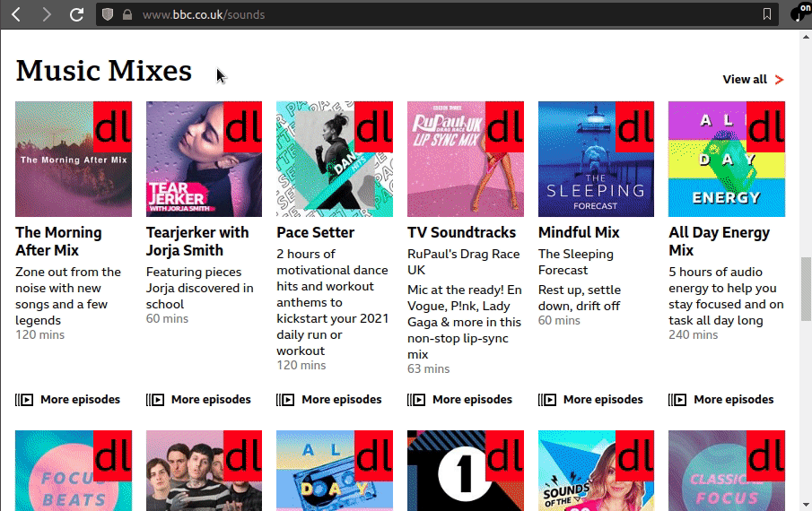

# dl-bbc-radio

Chrome extension wrapping basic functionality of get_iplayer CLI on bbc.co.uk/sounds pages.

If you just want to record programmes available on the BBC Sounds website , as you browse, without learning the CLI tool syntax and/or copying programme ids around, then this extension is for you!

If you want to use advanced features of get_iplayer or record TV programmes then you are better off sticking with the CLI, or using this project as a starting point. Note that a UK TV license is required to access BBC TV programmes.

## Screenshots:



## Features:
- Uses a 'dl-bbc-radio' preset which can configure the output directory for recordings, with an optional subdirectory template.
- Access to the CLI's logs.
- Recordings status and task queue.
- bbc.co.uk/sounds pages are enhanced with download buttons on radio programmes to trigger recording tasks.

## Requirements:
- get_iplayer (tested with version 3.26): https://github.com/get-iplayer/get_iplayer/wiki/installation
- Chrome-based browser (others not tested)
- Linux OS (others not tested)
- python3 to run the native host application

## Installation (linux):
- download this repository
- update the `HOST_PATH` in `./host/dl.bbc.radio.json` to the path the extension was downloaded to (eg: ```"path": "/home/michael/projects/web/dl-bbc-radio/nativeMessaging/host/dl-bbc-radio-host",```)
- copy `./host/dl.bbc.radio.json` to the Chrome's NativeMessagingHosts directory (eg: ```/home/michael/.config/vivaldi/NativeMessagingHosts```)
- open in browser `chrome://extensions`
- enable developer mode
- load unpacked, select `./app` directory
`./host/install_host.*` files are from the Chrome native messaging example project (which is very outdated). Maybe the `install_host.bat` script will install the NativeMessagingHosts on Windows. See `original.README.txt`.

## Known Limitations:
- Browsers installed as snaps are not compatible due to snap app confinement. More info at: https://forum.snapcraft.io/t/chrome-gnome-shell-does-not-work-with-chromium-snap/3377/2 and https://bugs.launchpad.net/ubuntu/+source/chromium-browser/+bug/1741074');
- Not tested on Windows / Mac or with browsers other than Vivaldi. Although with little effort support could be added.
- Uses manifest v2, will need updating to v3 at some point in the future. This will mean migrating from a background script to a serviceWorker.
- Frontend is plain JS, could use some cleanup and refactoring, and maybe introduction of JS framework.
- The logs page only collects logs of native messages which were received after the log page was opened. Older logs are not stored and not available on opening the log page.
- The extension is liable to break at any moment due to changes made to the BBC Sounds website or the get_iplayer software.
- Tasks are currently handled sequentially.

## Extending functionality:
To change get_iplayer recording settings, consider adding user preferences, or editing the 'dl-bbc-radio' preset via get_iplayer CLI.
To add new get_iplayer commands:
- add the command to the `COMMAND_MAP` in `commands.py`
- add an optional regex for the command args
- add a command handler function in `commands.py`
- add an optional messageHandler class to convert raw command logs to JSON to be consumed by the JS part of the extension in `commands.py`
- implement a way to trigger the command from the browser (see main.html for an example of input field to trigger commands manually)
- implement the browser-side logicv to handle the native messages

## Support / Reporting bugs:
Open an issue on this repo.

## Disclaimer:
Not an official get_iplayer or bbc/sounds extension.
User is responsible for legality of recordings.
No guaranteed support for special use-cases or system configurations.
No guarantees, use at your own risk.

## License:
MIT